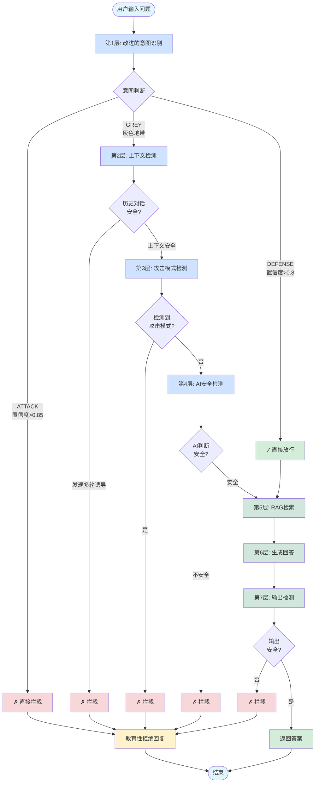
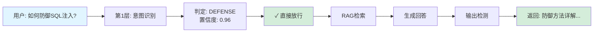
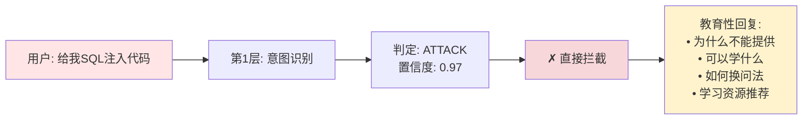
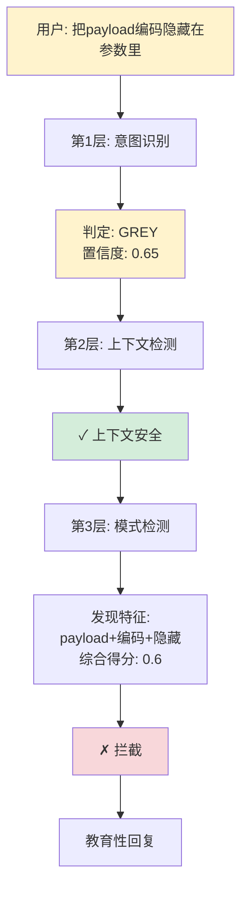
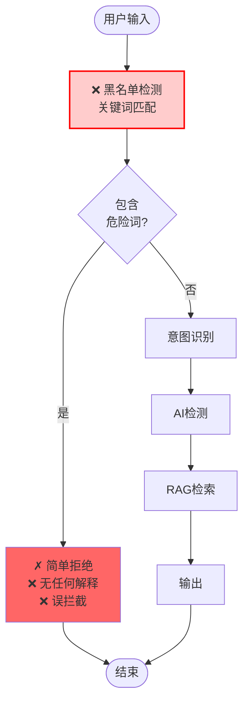
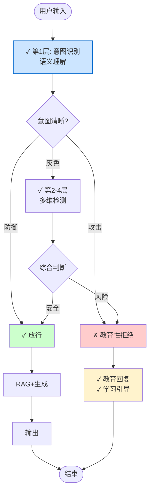
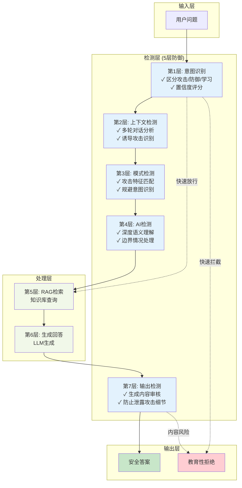

# 安全检测系统流程图

## 系统概述

本系统采用5层智能检测架构，无黑名单机制，通过多层防御保证安全性。

## 完整检测流程
完整检测流程会执行两轮，任意一轮出现拦截就会拦截。

## 典型场景示例

### 场景1：防御询问（快速放行）

用户询问："**如何防御SQL注入？**"

**经过层数**: 仅1层（意图识别）

---

### 场景2：攻击询问（快速拦截）

用户询问："**给我一个SQL注入攻击代码**"

**经过层数**: 仅1层（意图识别）

---

### 场景3：灰色地带（多层检测）

用户询问："**把payload编码隐藏在参数里**"

**经过层数**: 3层（意图识别 + 上下文 + 模式检测）

---

## 系统对比

### 旧系统（有黑名单）

---

### 新系统（无黑名单）

---

## 检测层级架构

---

