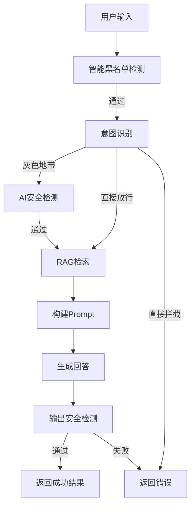

# 项目逻辑框架分析

## 一、整体架构
```
AI安全知识问答系统
├── 前端层（用户交互）
│   ├── 静态资源（CSS/JS）
│   └── 模板页面（index.html）
├── 应用层（Flask服务）
│   ├── 路由处理
│   └── 核心业务逻辑
├── 功能模块层
│   ├── 安全检测模块
│   ├── 意图识别模块
│   ├── 数据检索模块
│   ├── 提示词构建模块
│   └── 回答生成模块
└── 外部依赖
    └── 第三方API服务（对话/检索）
```

## 二、核心流程（main.py）

### 1. 入口点
- 启动Flask应用：`app.run()`
- 核心路由：`/chat`（处理用户查询）

### 2. 核心处理函数：`process_query(q: str) -> dict`
六层安全检测流程的调用链条：



#### 各步骤详情：
1. **黑名单检测**
   - 调用：`validate_user_input(q)`（来自guard.py）
   - 功能：过滤已知不安全输入

2. **意图识别**
   - 调用：`classify_intent(q)` 和 `validate_by_intent(q)`（来自intent_classifier.py）
   - 功能：分类用户意图（知识学习/攻击实施/防御实践/灰色地带）并判断处理策略

3. **AI安全检测（灰色地带）**
   - 调用：`is_input_safe(q)`（来自safety_agent.py）
   - 功能：对模糊意图进行二次安全校验

4. **RAG检索**
   - 调用：`search_common_database(q, 5)`（来自data_processor.py）
   - 功能：从知识库检索相关文档

5. **构建Prompt**
   - 调用：`build_prompt_v2(documents, q, intent_result)`（来自prompt_builder.py）
   - 功能：结合检索文档和意图信息生成提示词

6. **生成回答**
   - 调用：`answerLM(user_prompt, RAG_ANSWER_PROMPT_V2)`（来自conversation.py）
   - 内部调用：`dialogue()`（来自api_client.py，对接外部LLM服务）

7. **输出安全检测**
   - 调用：`is_output_safe(answer, intent_result)`（来自safety_agent.py）
   - 功能：验证生成内容的安全性

## 三、关键模块功能

| 模块文件 | 核心功能 | 主要函数 |
|---------|---------|---------|
| intent_classifier.py | 意图分类与验证 | classify_intent()、validate_by_intent() |
| data_processor.py | 知识库检索 | search_common_database() |
| prompt_builder.py | 动态构建提示词 | build_prompt_v2() |
| conversation.py | 调用LLM生成回答 | answerLM() |
| api_client.py | 外部API调用 | dialogue()、search_similar_files() |
| guard.py | 输入安全校验 | validate_user_input() |
| safety_agent.py | 输入/输出安全检测 | is_input_safe()、is_output_safe() |

## 四、用户交互流程
1. 用户通过前端页面（index.html）输入问题
2. 前端发送请求到`/chat`接口
3. 后端执行`process_query()`处理流程
4. 返回处理结果（回答或错误信息）
5. 前端渲染结果（使用marked.js和highlight.js处理格式）

## 五、安全控制
- 多层输入过滤（黑名单+意图识别+AI检测）
- 输出内容安全校验
- 基于意图的差异化回答策略
- 限制攻击代码/恶意内容的生成与返回